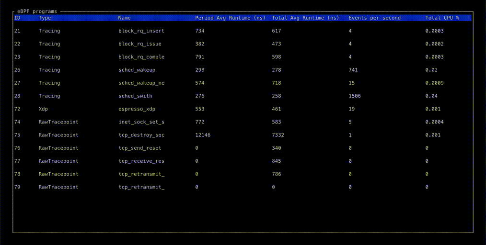

# bpftop


`bpftop` provides a dynamic real-time view of running eBPF programs. It displays the average runtime, events per second, and estimated total CPU % for each program. It also provides graphical views of these statistics over time. This tool minimizes overhead by enabling performance statistics only while it is active.



## Installation

To download the latest release of `bpftop`, use the following command:

```bash
curl -fLJ https://github.com/Netflix/bpftop/releases/latest/download/bpftop -o bpftop && chmod +x bpftop
```

or install via your distribution's package manager:

[](https://repology.org/project/bpftop/versions)

## Features

- Displays a list of all running eBPF programs on the host, including the ID, type, and name
- Shows the period and total average runtime for each eBPF program.
- Calculates the events per second and estimated CPU utilization for each eBPF program
- Provides a graphical view of the average runtime, events per second, and estimated CPU utilization over a 10-second time period
- Dynamically updates the list every second
- Enables the statistics-gathering function only while it is active

## Prerequisites

- `bpftop` requires `sudo` privileges to run.
- The Linux kernel version must be 5.8 or later.
- The binary is dynamically linked to `libz` and `libelf`, so these libraries must be present on the systems where you intend to run `bpftop`.

## Usage

Run the following command to start `bpftop` on your host:

```bash
sudo ./bpftop
```

## Relate links

* [Announcement blog post](https://netflixtechblog.com/announcing-bpftop-streamlining-ebpf-performance-optimization-6a727c1ae2e5)
* [LWN.net](https://lwn.net/Articles/963767/)
* [The New Stack](https://thenewstack.io/netflix-releases-bpftop-an-ebpf-based-application-monitor/)

## How it works

`bpftop` uses the [BPF_ENABLE_STATS](https://elixir.bootlin.com/linux/v6.6.16/source/include/uapi/linux/bpf.h#L792) BPF syscall command to enable global eBPF runtime statistics gathering, which is disabled by default to reduce performance overhead. It collects these statistics every second, calculating the average runtime, events per second, and estimated CPU utilization for each eBPF program within that sample period. This information is displayed in a top-like tabular format. Once `bpftop` terminates, it disables the statistics-gathering function by deleting the file descriptor returned by `BPF_ENABLE_STATS`.

## Building from source

1. Install and setup [cross](https://github.com/cross-rs/cross)
2. Run `cross build --release` for x86_64
3. Run `cross build --target=aarch64-unknown-linux-gnu --release` for Arm64
